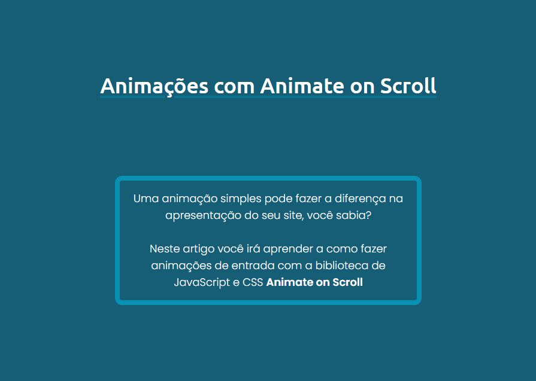

# Animate it!

**[Animate it - artigo](https://pmattheew.github.io/animate-it)**

O Animate It surgiu a partir de meu primeiro artigo de animação web, Animações com AOS, qual fiz para espalhar aos colegas de classe como fiz animações nos projetos que apresentei durante o curso do Senac, e vi que poderia render um repositório com diversos outros tutoriais de mesma orientação.

Este projeto inteiro desenvolvi em um só dia, começando na sala de aula e terminando em casa, e possui por enquanto apenas um artigo: como fazer animações que ativam ao rolar a página - porém logo terá mais.

O desenvolvi inteiro usando Tailwind CSS e a biblioteca Animate on Scroll para animações simples.
